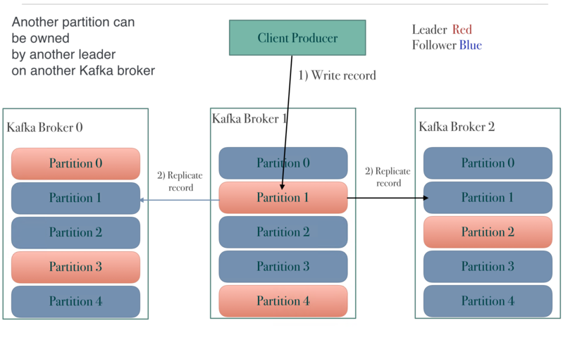
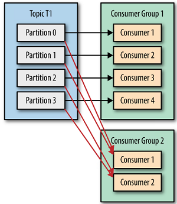
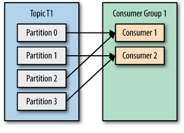
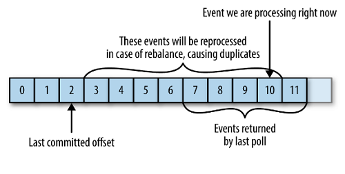

### Tổng quan

* Thành phần core của kiến trúc kafka là cụm các broker, có nhiệm vụ nhận về các messeage, phân chia logic topic, lưu trữ trên đĩa, nhân bản và phục hồi dữ liệu giữa các node, trả dữ liệu cho consumer khi yêu cầu
* Producer , Consumer là các node chạy các application sử dụng các API kafka,
  - Producer đưa dữ liệu nó thu thập được vào hệ thống messeage
  - Consumer kết nối , subscribe các topic lấy messeage về xử lý
* Zookeeper cung cấp một khung nhìn đồng bộ về cấu hình Kafka Cluster: có các broker nào, broker chứa các partition nào của topic, broker nào làm leader trong các partition topic, topic nào đang tạo, xóa, vị trí hiện tại, replicate, pending..., liên tục gửi các thay đổi cho kafka

### Topic architecture

* Mỗi topic như một chủ đề mà producer publish - consumer subscribe . Topic được lưu thành một số một partition lưu vào các broker. Việc chọn cho partition vào broker nào hoàn toàn có thể cấu hình.

* Các message trong mỗi partition được sắp xếp tuần tự (không thay đổi) giống thứ tự đưa lên Kafka cluster của các message. Mỗi message trong một partition được gán cho một định danh thứ tự, được gọi là một offset.

Theo như hình, topic lưu ra 4 partition. Quá trình viết producer sẽ phải chỉ ra muốn ghi vào partition nào (mặc định sẽ chọn theo round robin) . Quá trình ghi consummer sẽ phải chỉ ra muốn lấy từ patition và offset nào (mặc định sẽ lấy từ tất cả part, offset mới nhất).

* Với mỗi partition, tùy thuộc vào cấu hình sẽ có một số bản sao chép nhất định để đảm bảo dữ liệu không bị mất khi một node trong cụm bị hỏng.Mỗi broker lưu một bản sao ,chỉ số replicate không được vượt quá số lượng broker trong cụm. Bản chính của partition gọi là  “leader”. Khi ghi, các bản sao chép từ bản leader chứ không nhận dữ liệu trực tiếp từ producer ; các bản sao cũng không đọc song song bởi consumer, không có vai trò trong việc tối ưu đọc và ghi.

* Trên đĩa của các node broker, topic được lưu mức thấp thành các thư mục, file ( gọi là logs). Theo defaut thư mục lưu sẽ là ``/tmp/kafka-logs/`` . Trong thư mục, mỗi topic-patition sẽ thành một thư mục con, các message lưu trong các file log thuộc thư mục này.

* Mặc định các logs lưu trong vòng 7 ngày (với restart thì thư mục /tmp/ sẽ mất nên cần chú ý cấu hình lại)

### Consumer and Producers architecture

Consumer với nhiệm vụ lấy dữ liệu từ kafka, thì có thể tổ chức thành các consumer group. Mục đích: tăng cường tốc độ đọc, failover. Cụ thể: 

* Kafka quy định: bất kỳ lúc nào, mỗi partition chỉ được 1 consumer trong mỗi consumer group đọc. 
 ví dụ: ở hình dưới, topic 1 nhận vào 4 messeage (m0, m1, m2, m3) thì sẽ vào patition theo sắp xếp:
  &nbsp;    &nbsp;- part0 chứa m0. part1 chứa m1. part2 chứa m2. part3 chứa m3
  messesage lấy về các consumer sẽ có vị trí: 
  &nbsp;    &nbsp;- Group1: consummer0 nhận m0. consummer1 nhận m1. consummer2 nhận m2. consummer3 nhận m3
  &nbsp;    &nbsp;- Group2: consummer0 nhận m0,m1. consummer0 nhận m2,m3
  Giả sử là các consumer chạy cùng tiến trình spark, nhận message về, cùng xử lý và cùng đẩy kết quả ra một topic đích, thì hiệu năng xử lý sẽ tăng đáng kể.

* Ví dụ 1 consumer chết, các consumer khác trong group sẽ tiếp nhận thay các message từ message mà consumer chết nhận được cuối cùng => failover
  Tuy vậy ta thấy: theo cơ chế, kafka không track xem consumer đã nhận được message nào, vậy làm thế nào các consumer cùng group biết để takeover? 
  - Mỗi consumer khi đọc một messeage tại offset nhất định trên partition, sẽ thực hiện thao tác gọi là commit: ghi offset hiện tại vào một topic đặc biệt tên là __consumer_offsets topic.
  ví dụ: trong trường hợp trên, 2 consumer 3 và 4 chết. Kafka rebalance lại phân phối patititon cho group
  &nbsp;    &nbsp;- Group1: consummer0 nối part0,part3. consummer1 nối part1,part3. như hình dưới

Consumer vào làm việc, sẽ lấy vào "latest committed offset" của mối partition từ __consumer_offsets topic và takeover
  Chú ý rằng: nhiệm vụ commit thuộc về phía consumer, tức người lập trình ra ứng dụng, kafka broker không có nhiệm vụ gì trong này (ngoài tự động tạo ra __consumer_offsets topic).
  Việc commit có thể ảnh hưởng đến kết quả xử lý, vd:
  Thực tế đang xử lý tới offset 10, trong khi mới commit tới offset 2. Khi lỗi xảy ra buộc ta lại quay lại offset 2 xử lý. Đây có thể là lỗi - khi một messeage bị xử lý 2 lần; cũng có thể là tính năng: -vận dụng hợp lý sẽ như một điểm checkpoint cho luồng, mục đích là khi lỗi sẽ roolback để xử lý lại đoạn 2 đến 10.

Producer với nhiệm vụ đẩy dữ liệu vào kafka. Có một số điểm đáng chú ý sau:

* Kafka cung cấp cơ chế cho producer đợi messeage vừa gửi đi đến các mức level: 
  - Ack = all: đợi cho leader và tất cả các replicate đã ghi rồi gửi tiếp messeage khác
  - Ack = 1: chỉ đợi leader xác nhận đã ghi
  - Ack = 0: không đợi, gửi luôn messeage khác
* Kafka cung cấp cơ chế tạo các producer với 2 mode đặc biệt:
  - Idempotent : đảm với 1 messeage yêu cầu ghi thì chỉ đúng 1 messeage xuất hiện trong topic
  - Transactional : đảm bảo một nhóm các messeage cùng được gửi với nhau.
 

### Ref
http://cloudurable.com/blog/kafka-architecture/index.html

https://kafka.apache.org/documentation/

https://www.oreilly.com/library/view/kafka-the-definitive/9781491936153/ch04.html

