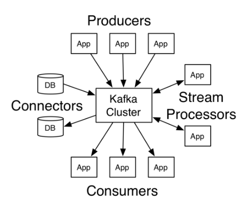

# Tổng quan
* Khái niệm:
Kafka is a publish-subscribe distributed, partitioned, replicated commit log service. It provides the functionality of a messaging system, but with a unique design.

* Hoạt động cơ bản:  

  - Kafka lưu trữ các message thành các category gọi là topic
  - Kafka được triển khai theo mô hình cluster gồm một hoặc nhiều server. Mỗi server trong cluster này được gọi là một "broker", nhiệm vụ như một kho lưu trữ các message.
  - Chúng ta sẽ sử dụng một tiến trình để đưa dữ liệu message vào Kafka. Tiến trình này gọi là producer. 
  - Chúng ta sẽ sử dụng một tiến trình để lấy dữ liệu message từ Kafka. Tiến trình này gọi là consumer.
  - Producer, consumer có thể khởi động những tool như console_producer, console_consumer kafka cung cấp, hay các application tự viết dùng các api.
  - Các application sử dụng các 4 loại API (Producer API, Consumer API, Streams API và  Connector API) thực hiện các tương tác mong muốn . 

# Đặc trưng
### Publish-Subscribe Messaging System

Ta có 2 loại hệ thống messeages truyền thống:

&nbsp;    &nbsp;- Với những hệ thống "Queuing". Messages tổ chức thành các queue, một hoặc nhiều consummer lấy message từ queue và chủ động xóa messeage đó khỏi queue. 

&nbsp;    &nbsp;- Với những hệ thống "Publish-Subscribe". Messeages tổ chức thành một hoặc nhiều topic. Consumers có thể chọn subscribe các toppic mà mình muốn đọc.  

<b> Kafka mang đặc điểm của hệ Publish-Subscribe nhưng có điểm đặc biệt: </b>

&nbsp;    &nbsp;- Với hệ thống Publish-Subscribe truyền thống, mỗi messeage sẽ được broad cast ra cho tất cả các consumer. vd: nếu messeage đến là m1, m2, m3. các consumer sẽ đều nhận được m1, m2, m3

&nbsp;    &nbsp;- Với kafka, cho phép cơ chế nhóm các consumer để mỗi consumer trong nhóm có thể nhận một phần luồng tin.  vd: nếu messeage đến là m1, m2, m3. cho phép consummer1 nhận m1, consumer2 nhận m2 , consumer 3 nhận m3. (với điều kiện consumer 1, 2, 3 cùng group; nếu khác group, messeage sẽ broad cast như bình thường)  

&nbsp;    &nbsp;Mục đích việc này là giúp cho scale process xử lý của consumer, chia ra mỗi consumer xử lý một phần của luồng messeage.

<b> Kafka sẽ không thực hiện: </b>

&nbsp;    &nbsp; - Theo dõi xem topic chỉ giới hạn cho consumer nào nhận ,hay consumer đã nhận được message chưa (no check ack form consumer).

&nbsp;    &nbsp; - Không có thao tác delete, messeages sẽ được giữ trong khoảng thời gian xác định và tự động xóa.

&nbsp;    &nbsp; - Không random access vào từng messeage. Consumers chỉ ra sẽ nhận messeage từ offset bao nhiêu của topic thì sẽ nhận được các message, bắt đầu từ offset đó. 

&nbsp;    &nbsp;Như vậy, trách nhiệm của consumer trong xử lý dữ liệu từ kafka là rất lớn. Kafka không có trách nhiệm push() messeage cho consumer, mà consumer sẽ poll() messeage cần về, tùy theo năng lực xử lý của nó.
  Một số thảo luận về điều này   
https://www.quora.com/How-do-I-verify-if-Kafka-Consumer-consumed-messages

### Tốc độ nhanh
Với một máy đơn cài đặt Kafka có thể xử lý số lượng dữ liệu từ việc đọc và ghi lên tới hàng trăm megabyte trong một giây từ hàng ngàn máy khách. 
vd benchmark cho kafka trên các hệ thống cloud: 

theo https://hackernoon.com/benchmarking-kafka-performance-part-1-write-throughput-7c7a76ab7db1

### Khả năng mở rộng: 
Kafka được thiết kế cho phép dễ dàng được mở rộng và trong suốt với người dùng (không downtime khi thêm một nút máy chủ mới vào cụm). Luồng dữ liệu sẽ được phân chia và được vận chuyển tới các nút trong cụm, do đó cho phép trung chuyển các dữ liệu mà có khối lượng lớn hơn nhiều so với sức chứa của một máy đơn.

### Độ tin cậy: 
Dữ liệu vào hàng đợi sẽ được lưu trữ trên ổ đĩa và được sao chép tới các nút khác trong cụm để ngăn ngừa việc mất dữ liệu, đảm bảo tính chịu lỗi cao.

## Reference

https://techbeacon.com/what-apache-kafka-why-it-so-popular-should-you-use-it

https://www.confluent.io/blog/apache-kafka-vs-enterprise-service-bus-esb-friends-enemies-or-frenemies/?fbclid=IwAR3A_Lcl7sgRTinzJUUwyQwNBm8V_3vCokFXuZcomXD1NlPNDmpb34f41po

https://www.tutorialspoint.com/apache_kafka/index.htm

https://dzone.com/articles/understanding-kafka-consumer-groups-and-consumer-l

https://kafka.apache.org/
