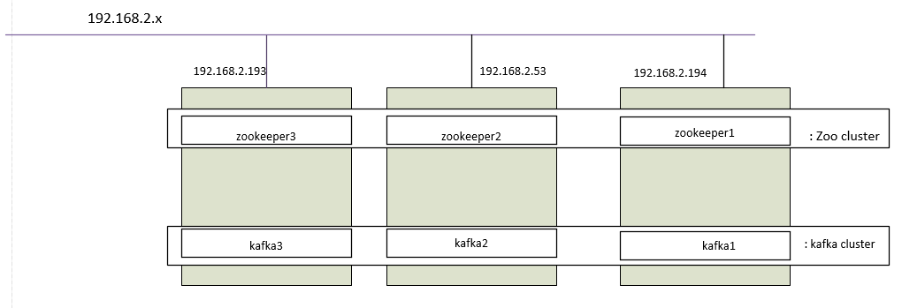

###Nội dung

Mục đích bài viết là chỉ ra cách cấu hình một cụm zookeeper 3 node cùng kafka gồm 3 broker có thể failover : 1 kafka, 1 zookeeper hay 1 host chết vẫn có thể hoạt động bình thường;

### Mô hình 



### Cài đặt

* **Tạo user , dowload kafka-zookeeper**

Tạo user kafka
```
sudo useradd kafka -m
sudo passwd kafka
sudo adduser kafka sudo
su -l kafka
```

Dowload kafka, kafka cũng đã có sẵn bản zookeeper kèm theo.

```
curl "http://www-eu.apache.org/dist/kafka/1.1.0/kafka_2.12-1.1.0.tgz" -o ~/kafka.tgz
mkdir ~/kafka && cd ~/kafka
tar -xvzf ~/kafka.tgz --strip 1
```
Các file chạy, cấu hình hiện đã giải nén ra thư mục ~/kafka

* **Thực hiện cấu hình** 

Cấu hình cụm zookeeper: làm trên tất cả các host:

bước 1:) Sửa file kafka/config/zookeeper.properties thành nội dung:

```
initLimit=5
syncLimit=2
dataDir=/home/kafka/Data/zookeeper
clientPort=2181
server.1=192.168.2.194:2888:3888
server.2=192.168.2.153:2888:3888
server.3=192.168.2.193:2888:3888
```
Trong đó  port 2181 cho client connections; 2888 cho follower connections (nếu nó là zookeeper leader); and 3888 cho các server khác kết nối khi quá trình bầu leader đang diễn ra.

"server.1=192.168.2.194" tức ta đã khai báo zookeeper id cho host 192.168.2.194 là id 1

Trỏ "dataDir=/home/kafka/Data/zookeeper" thì ta cũng cần tạo một thư mục trống /home/kafka/Data/zookeeper

bước 2:) vào thư mục /home/kafka/Data/zookeeper , tạo file myid, nội dung là zookeeper id ở trên:

ví dụ với host zookeeper 1 : 192.168.2.194

```
echo "1" > /home/kafka/Data/zookeeper/myid
```
Bước 3:) chạy zookeeper trên mỗi host:

```
/home/kafka/kafka/bin/zookeeper-server-start.sh /home/kafka/kafka/config/zookeeper.properties
```
Cấu hình cụm kafka: làm trên tất cả các host:

bước 1:) Sửa file ~/kafka/config/server.properties

Thay ```broker.id=x```với x là id kafka của từng host, vd host 192.168.2.194 ```broker.id=1```

Liệt kê host trong cụm zookeeper tại ```zookeeper.connect=<host>:port```. ví dụ với cụm trên ```zookeeper.connect=192.168.2.194:2181,192.168.2.193:2181,192.168.2.53:2181```

Thêm dòng: ```delete.topic.enable = true``` cho phép kafka broker có thể xóa topic.

bước 2:) chạy kafka:

```
/bin/sh -c '/home/kafka/kafka/bin/kafka-server-start.sh /home/kafka/kafka/config/server.properties > /home/kafka/kafka/kafka.log 2>&1'
```

* **Tạo replicate cho topic __consumer_offsets**

__consumer_offsets là topic được tạo mặc định, rất quan trọng vì nó giữ vị trí offset đang đọc tới của consummer. Tuy nhiên khi mới tạo nó sẽ lấy replicate 1 cùng patition 50. Ta cần tăng số replicate của nó lên. 

bước 1:)Tạo file inc-replication-factor.json với nội dung:

```
{"version":1,
 "partitions":[
   {"topic":"__consumer_offsets", "partition":0,  "replicas":[1, 2, 3]},
   {"topic":"__consumer_offsets", "partition":1,  "replicas":[1, 2, 3]},
   {"topic":"__consumer_offsets", "partition":2,  "replicas":[1, 2, 3]},
   {"topic":"__consumer_offsets", "partition":3,  "replicas":[1, 2, 3]},
   {"topic":"__consumer_offsets", "partition":4,  "replicas":[1, 2, 3]},
   {"topic":"__consumer_offsets", "partition":5,  "replicas":[1, 2, 3]},
   {"topic":"__consumer_offsets", "partition":6,  "replicas":[1, 2, 3]},
   {"topic":"__consumer_offsets", "partition":7,  "replicas":[1, 2, 3]},
   {"topic":"__consumer_offsets", "partition":8,  "replicas":[1, 2, 3]},
   {"topic":"__consumer_offsets", "partition":9,  "replicas":[1, 2, 3]},
   {"topic":"__consumer_offsets", "partition":10, "replicas":[1, 2, 3]},
   {"topic":"__consumer_offsets", "partition":11, "replicas":[1, 2, 3]},
   {"topic":"__consumer_offsets", "partition":12, "replicas":[1, 2, 3]},
   {"topic":"__consumer_offsets", "partition":13, "replicas":[1, 2, 3]},
   {"topic":"__consumer_offsets", "partition":14, "replicas":[1, 2, 3]},
   {"topic":"__consumer_offsets", "partition":15, "replicas":[1, 2, 3]},
   {"topic":"__consumer_offsets", "partition":16, "replicas":[1, 2, 3]},
   {"topic":"__consumer_offsets", "partition":17, "replicas":[1, 2, 3]},
   {"topic":"__consumer_offsets", "partition":18, "replicas":[1, 2, 3]},
   {"topic":"__consumer_offsets", "partition":19, "replicas":[1, 2, 3]},
   {"topic":"__consumer_offsets", "partition":20, "replicas":[1, 2, 3]},
   {"topic":"__consumer_offsets", "partition":21, "replicas":[1, 2, 3]},
   {"topic":"__consumer_offsets", "partition":22, "replicas":[1, 2, 3]},
   {"topic":"__consumer_offsets", "partition":23, "replicas":[1, 2, 3]},
   {"topic":"__consumer_offsets", "partition":24, "replicas":[1, 2, 3]},
   {"topic":"__consumer_offsets", "partition":25, "replicas":[1, 2, 3]},
   {"topic":"__consumer_offsets", "partition":26, "replicas":[1, 2, 3]},
   {"topic":"__consumer_offsets", "partition":27, "replicas":[1, 2, 3]},
   {"topic":"__consumer_offsets", "partition":28, "replicas":[1, 2, 3]},
   {"topic":"__consumer_offsets", "partition":29, "replicas":[1, 2, 3]},
   {"topic":"__consumer_offsets", "partition":30, "replicas":[1, 2, 3]},
   {"topic":"__consumer_offsets", "partition":31, "replicas":[1, 2, 3]},
   {"topic":"__consumer_offsets", "partition":32, "replicas":[1, 2, 3]},
   {"topic":"__consumer_offsets", "partition":33, "replicas":[1, 2, 3]},
   {"topic":"__consumer_offsets", "partition":34, "replicas":[1, 2, 3]},
   {"topic":"__consumer_offsets", "partition":35, "replicas":[1, 2, 3]},
   {"topic":"__consumer_offsets", "partition":36, "replicas":[1, 2, 3]},
   {"topic":"__consumer_offsets", "partition":37, "replicas":[1, 2, 3]},
   {"topic":"__consumer_offsets", "partition":38, "replicas":[1, 2, 3]},
   {"topic":"__consumer_offsets", "partition":39, "replicas":[1, 2, 3]},
   {"topic":"__consumer_offsets", "partition":40, "replicas":[1, 2, 3]},
   {"topic":"__consumer_offsets", "partition":41, "replicas":[1, 2, 3]},
   {"topic":"__consumer_offsets", "partition":42, "replicas":[1, 2, 3]},
   {"topic":"__consumer_offsets", "partition":43, "replicas":[1, 2, 3]},
   {"topic":"__consumer_offsets", "partition":44, "replicas":[1, 2, 3]},
   {"topic":"__consumer_offsets", "partition":45, "replicas":[1, 2, 3]},
   {"topic":"__consumer_offsets", "partition":46, "replicas":[1, 2, 3]},
   {"topic":"__consumer_offsets", "partition":47, "replicas":[1, 2, 3]},
   {"topic":"__consumer_offsets", "partition":48, "replicas":[1, 2, 3]},
   {"topic":"__consumer_offsets", "partition":49, "replicas":[1, 2, 3]}
 ]
}
```

bước 2:) Thực hiện partition reassignment:

```
~/kafka/bin/kafka-reassign-partitions.sh --zookeeper 192.168.2.193:2181 \
    --reassignment-json-file /home/kafka/inc-replication-factor.json  \
    --execute
```

Kiểm tra kết quả:

```
~/kafka/bin/kafka-topics.sh --zookeeper 192.168.2.193 --describe --topic __consumer_offsets
```

Như vậy, hiện giờ nếu tạo topic , ta nên để replicate 3 giúp failover: 

```
~/kafka/bin/kafka-topics.sh --create --zookeeper localhost:2181 --replication-factor 3 --partitions 1 --topic rep3
```