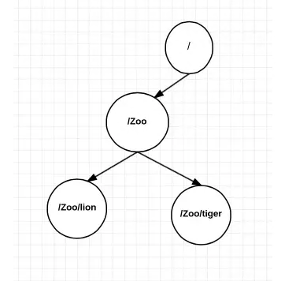
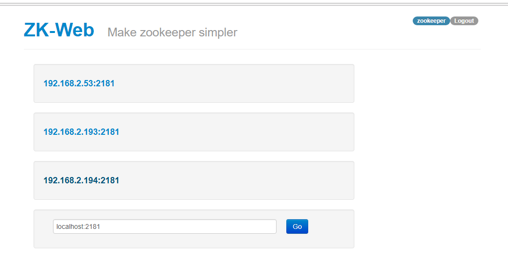
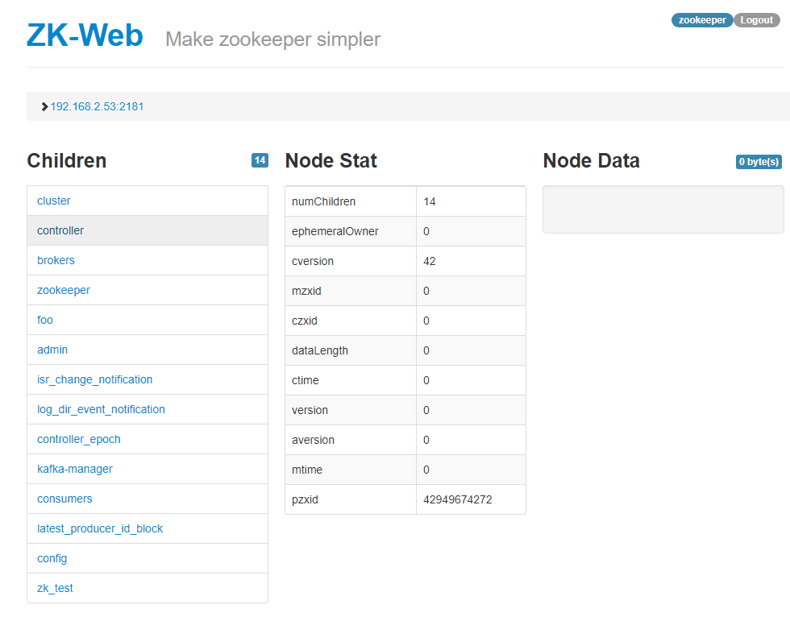

### Tổng quan:

Zookeeper là một dịch vụ dùng nhằm duy trì sự thống nhất thông tin cấu hình của các service chạy cluster: 
* distributed configuration management 
* consensus building through coordination and locks. 

Zookeeper luôn cài kèm khi ta cài Kafka, giúp các kafka-broker đạt được sự đồng thuận về các thông tin như: số lượng, id, địa chỉ của các broker; mỗi topic có bao nhiêu partition, mỗi partition nằm tại broker nào; khi có reassigne, rebalance topic sẽ thống nhất chuyển patition về đâu, và một số thông tin phụ khác

Về cơ bản , ý nghĩa của zookeeper cũng giống etcd : lưu các thông tin của cluster, thông báo khi có thay đổi. Một so sánh 2 service: https://stackshare.io/stackups/etcd-vs-zookeeper

Các thao tác vận hành zookeeper cũng như etcd, chỉ xoay quanh: thêm, sửa xóa dữ liệu về cấu hình cluster lưu trên zookeeper.

### Tổ chức dữ liệu trong zookeeper:

Dữ liệu trong zookeeper tổ chức như dạng cây, cây thư mục: 



* Mỗi node trong cây gọi là zNode
* Mỗi zNode được định danh bởi path đến node. ví dụ ở hình có 4 Znode: /; /Zoo; /Zoo/lion; /Zoo/tiger
* Mỗi zNode có thể ghi một data (string, byte) 
* Mỗi zNode có thể có các Znode con
* Ta có thể thêm sửa xóa zNode cũng như data trên node, add node con, tuy nhiên không thể rename node

### Thực hành :
Sau khi cài kafka, thường ta đã có zookeeper chạy kèm, cổng 2181

a) Thao tác với console:

Vào thư mục cài kafka ( ~/kafka), mở zookeeper console với lệnh:

```
bin/zookeeper-shell.sh localhost:2181

Connecting to localhost:2181
Welcome to ZooKeeper!
JLine support is disabled

WATCHER::

WatchedEvent state:SyncConnected type:None path:null

```

* Xem các cấu hình một cluster bất kỳ: lệnh ls

```
ls /
[cluster, controller, brokers, zookeeper, foo, admin, isr_change_notification, log_dir_event_notification, controller_epoch, kafka-manager, consumers, latest_producer_id_block, config]
ls /brokers
[ids, topics, seqid]

```

* Thêm một znode zk_test với data "test"

```
create /zk_test my_data
Created /zk_test

```

* xem data node /zk_test :

```
get /zk_test
my_data
...

```

* thêm con child1 vào /zk_test :
```
create /zk_test/Child1 "firstchild"
Created /zk_test/Child1
```

Các thao các cơ bản xem thêm tại: http://www.corejavaguru.com/bigdata/zookeeper/cli

b) Sử dụng drashboard:

Để thuận thiện nhanh chóng ta có thể dùng drashboard:

```
docker run -d \
  -p 8080:8080 \
  -e ZK_DEFAULT_NODE=localhost:2181/ \
  -e USER=zookeeper \
  -e PASSWORD=zookeeper \
  --name zk-web \
  -t tobilg/zookeeper-webui
```

Ta sẽ tạo ra 1 web-UI lắng nghe cổng 8080. user:password zookeeper:zookeeper



Chọn vào host zookeeper : vd 192.168.2.194:2181 . Ta có danh sách các Node nối với root


CLick vào từng node để xem tiếp theo. Thêm sửa xóa ở gần chỗ footer của website.

###[Sử dụng zookeeper kết hợp với kafka](HA_configuration.md)